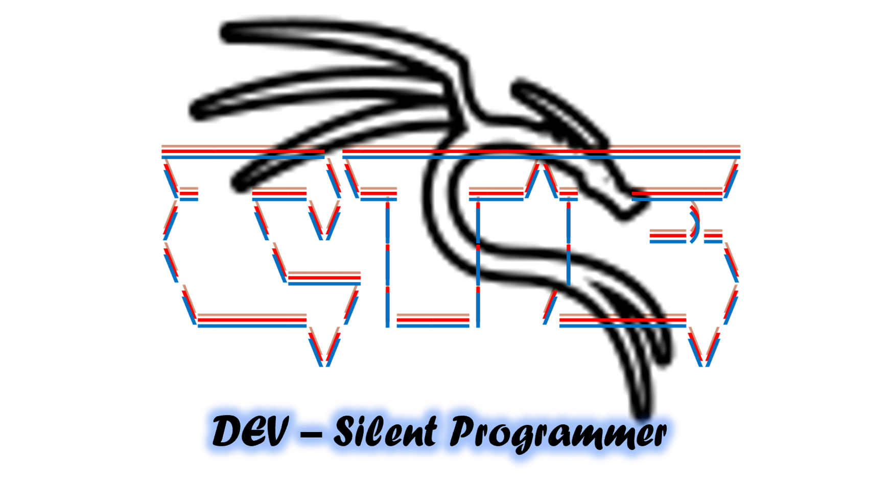

# CTE - One-click terminal enhancement tool



CTE is a bash-based script that enchance your Terminal.

## Features
- Compatible with both rooted and non-rooted Android devices.
- No root access required.
- Seamless integration with Termux environment.

## Installation
1. Open Termux on your Android device.
2. Clone this repository:

    ```bash
    git clone https://github.com/Tanmay-Tiwaricyber/CTE.git
    ```

3. Navigate to the cloned directory:

    ```bash
    cd CTE
    ```

4. Grant execute permission to the script:

    ```bash
    chmod +x CTE.sh
    ```

5. Run the script:

    ```bash
    ./CTE.sh
    ```

